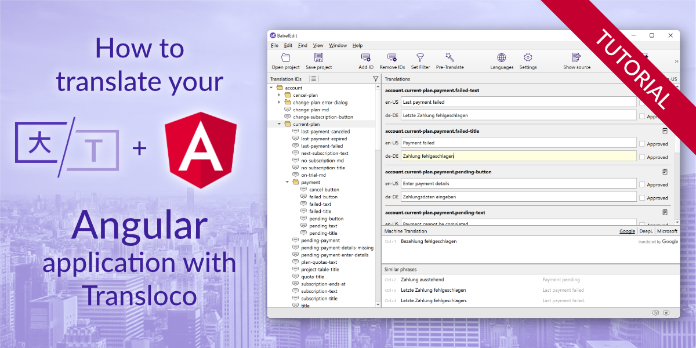

# Angular + Transloco Translation Example

This is a simple demo project for our tutorial: [How to translate your Angular app with Transloco](https://www.codeandweb.com/babeledit/tutorials/how-to-translate-your-angular-app-with-transloco).

